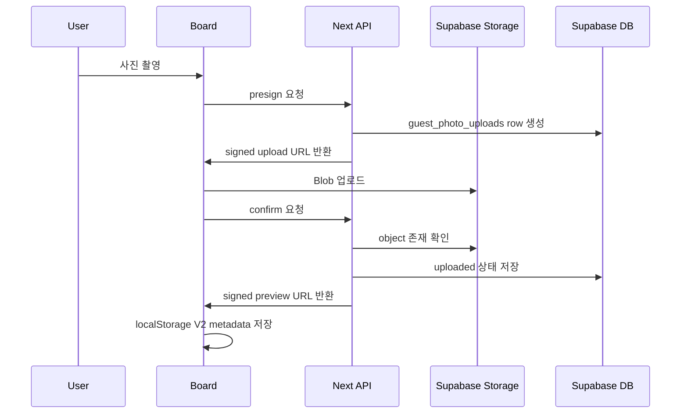
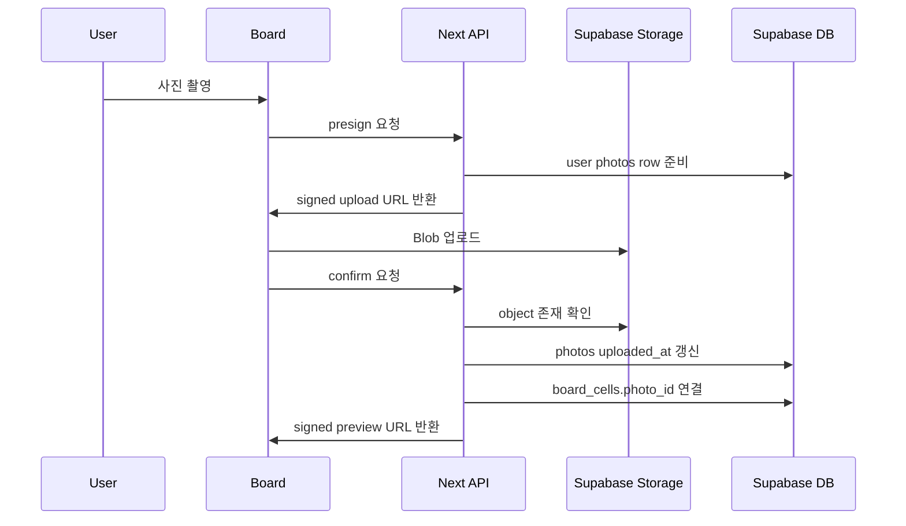
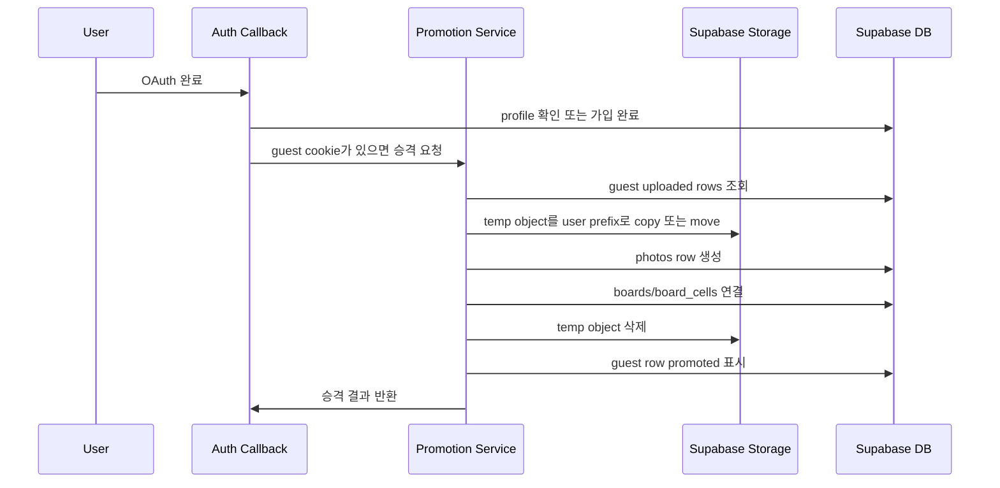

# Supabase Storage 유저별 사진 저장 기획

상태: 구현 및 로컬/원격 smoke test 완료  
작성일: 2026-05-16  
최종 업데이트: 2026-05-16  
결정: 이미지 저장은 Cloudflare R2를 쓰지 않고 Supabase Storage로 통일한다.  
대상 범위: 로그인 유저 사진 저장, 비로그인 임시 사진 저장, 가입/로그인 후 사진 승격, 3일 만료 삭제  
상위 보류 기획: `/Users/oksang/Desktop/sappeun/sappeun/docs/todo/auth-app-storage-share-plan.md`

## 0. 핵심 결론

사뿐의 이미지 저장은 Supabase Storage로 통일한다. 사진 파일은 Supabase Storage private bucket에 저장하고, 사진이 어떤 유저와 보드/칸에 연결되는지는 Supabase Postgres에 저장한다. Supabase Auth, Postgres, RLS, Storage를 한 서비스 안에서 묶어 권한과 데이터 흐름을 단순하게 유지한다.

Cloudflare R2는 이번 MVP 범위에서 제외한다. R2는 egress와 CDN 측면에서 장점이 있지만, 현재 사뿐에는 Supabase Auth/DB/RLS와 Storage를 함께 쓰는 편이 구현과 운영이 더 단순하다. 공개 공유 이미지 트래픽이 실제로 커진 뒤에만 R2 또는 Cloudflare CDN 이전을 다시 검토한다.

현재 보드 화면은 사진을 서버에 저장하지 않고 `Blob`과 `ObjectURL`만 메모리에 들고 있다. 이번 작업은 그 로컬 임시 상태를 Supabase Storage 저장 흐름으로 바꾸는 것이다.

## 구현 완료 메모

2026-05-16 현재 이 기획은 구현과 smoke test를 마쳤다. 실제 저장소는 Supabase Storage private bucket `photos-private`로 통일했고, Cloudflare R2 관련 클라이언트와 환경변수 요구는 제거했다.

반영된 주요 파일:

- `/Users/oksang/Desktop/sappeun/sappeun/src/lib/storage/photos.ts`
- `/Users/oksang/Desktop/sappeun/sappeun/src/lib/photos/server.ts`
- `/Users/oksang/Desktop/sappeun/sappeun/src/lib/photos/client.ts`
- `/Users/oksang/Desktop/sappeun/sappeun/src/app/api/photos/presign/route.ts`
- `/Users/oksang/Desktop/sappeun/sappeun/src/app/api/photos/confirm/route.ts`
- `/Users/oksang/Desktop/sappeun/sappeun/src/app/api/photos/preview/route.ts`
- `/Users/oksang/Desktop/sappeun/sappeun/src/app/api/photos/[photoId]/route.ts`
- `/Users/oksang/Desktop/sappeun/sappeun/src/app/api/photos/promote-guest/route.ts`
- `/Users/oksang/Desktop/sappeun/sappeun/src/app/api/boards/active/route.ts`
- `/Users/oksang/Desktop/sappeun/sappeun/src/app/api/jobs/cleanup-temp-photos/route.ts`
- `/Users/oksang/Desktop/sappeun/sappeun/src/components/bingo/Board.tsx`
- `/Users/oksang/Desktop/sappeun/sappeun/src/components/home/HomeClient.tsx`
- `/Users/oksang/Desktop/sappeun/sappeun/supabase/migrations/0005_supabase_storage_photos.sql`
- `/Users/oksang/Desktop/sappeun/sappeun/supabase/migrations/0006_photo_board_pending_uploads.sql`
- `/Users/oksang/Desktop/sappeun/sappeun/vercel.json`

검증 완료:

- 원격 Supabase SQL Editor에 Storage/metadata migration 적용 완료
- REST schema smoke test로 `boards.client_session_id`, `photos.board_id/position/cell_id`, `guest_photo_uploads.promoted_*`, `photos-private` bucket 확인
- Chrome에서 로그인 유저 카메라 촬영, signed upload, confirm, preview restore, delete 확인
- 비로그인 guest API smoke test로 presign, signed upload, confirm, preview, delete 확인
- 삭제 후 `photos.deleted_at` 기록 및 `board_cells.photo_id` 참조 해제 확인
- `pnpm lint`, `pnpm exec tsc --noEmit`, `pnpm build` 통과

남은 운영 설정:

- Vercel Production/Preview 환경변수에 `SUPABASE_SERVICE_ROLE_KEY`와 `CRON_SECRET`을 설정해야 한다.
- `vercel.json`에 cleanup cron은 등록되어 있으므로, 배포 환경에서 `CRON_SECRET`이 없으면 `/api/jobs/cleanup-temp-photos`는 인증 실패한다.

## 1. 목표

완료 후 사용자는 아래 경험을 해야 한다.

1. 로그인하지 않아도 산책 중 사진을 찍으면 Supabase Storage에 임시 저장된다.
2. 같은 기기에서 새로고침해도 진행 중 보드와 사진 미리보기를 복구할 수 있다.
3. 로그인 또는 회원가입을 하면 임시 사진이 계정 사진으로 옮겨진다.
4. 계정 사진으로 옮겨진 뒤에는 다른 기기에서도 이어볼 수 있다.
5. 로그인하지 않은 임시 사진은 생성 후 3일이 지나면 삭제된다.
6. 로그인 유저의 사진은 본인만 조회, 교체, 삭제할 수 있다.

## 2. 범위

포함:

- Supabase Storage bucket 생성과 access policy 설계
- signed upload URL 또는 서버 route 기반 업로드 API
- 업로드 완료 confirm API
- 로그인 유저용 `photos` 저장과 `board_cells.photo_id` 연결
- 비로그인 guest session 발급
- 비로그인 임시 사진 metadata 저장
- guest 사진을 로그인 유저 사진으로 승격하는 promotion flow
- 임시 사진 3일 만료 삭제 정책
- 보드 화면의 업로드/재시도/삭제 상태
- 서버 저장 사진의 signed preview URL 재발급

제외:

- Cloudflare R2 저장
- Cloudflare CDN/custom domain 이미지 serving
- 공개 공유 페이지 전체 구현
- 공유용 이미지 생성
- 사진 편집/필터 기능
- 유료 저장 용량 관리
- 네이티브 앱 로컬 파일 저장
- 다중 계정 간 사진 이전

## 3. 현재 코드 기준

이미 있는 기반:

- `/Users/oksang/Desktop/sappeun/sappeun/src/components/bingo/Board.tsx`
- `/Users/oksang/Desktop/sappeun/sappeun/src/components/camera/CameraModal.tsx`
- `/Users/oksang/Desktop/sappeun/sappeun/src/lib/bingo/persistence.ts`
- `/Users/oksang/Desktop/sappeun/sappeun/src/types/persisted-board.ts`
- `/Users/oksang/Desktop/sappeun/sappeun/src/types/photo.ts`
- `/Users/oksang/Desktop/sappeun/sappeun/src/lib/supabase/client.ts`
- `/Users/oksang/Desktop/sappeun/sappeun/src/lib/supabase/server.ts`
- `/Users/oksang/Desktop/sappeun/sappeun/supabase/migrations/0001_init.sql`
- `/Users/oksang/Desktop/sappeun/sappeun/supabase/migrations/0002_rls.sql`
- `/Users/oksang/Desktop/sappeun/sappeun/src/app/(auth)/auth/callback/route.ts`
- `/Users/oksang/Desktop/sappeun/sappeun/src/lib/auth/profile.ts`
- `/Users/oksang/Desktop/sappeun/sappeun/src/lib/auth/session.ts`
- `/Users/oksang/Desktop/sappeun/sappeun/docs/ENV.md`

정리 대상:

- `/Users/oksang/Desktop/sappeun/sappeun/src/lib/r2/client.ts`
- `/Users/oksang/Desktop/sappeun/sappeun/src/lib/r2/presign.ts`
- `/Users/oksang/Desktop/sappeun/sappeun/src/lib/r2/keys.ts`
- `package.json`의 `@aws-sdk/client-s3`
- `package.json`의 `@aws-sdk/s3-request-presigner`
- `docs/ENV.md`의 R2 관련 환경변수 설명

현재 동작:

- `Board.tsx`의 `PhotoEntry`는 `blob`과 `url`만 가진다.
- 촬영 후 `URL.createObjectURL(blob)`로 화면에 표시한다.
- localStorage에는 보드 session, cell ids, marked positions만 저장한다.
- 사진 blob과 서버 photo id는 저장하지 않는다.

## 4. 제품 원칙

사진 저장은 플레이를 막는 장벽이 아니어야 한다. 사용자는 먼저 산책 빙고를 시작하고, 계정은 기록을 보존하고 싶어지는 순간 자연스럽게 연결한다.

사진은 개인 정보가 될 수 있으므로 기본값은 비공개로 둔다. Supabase Storage bucket은 private으로 만들고, 앱이 필요한 순간에만 짧게 만료되는 signed URL을 발급한다. 공개 공유는 사용자가 명시적으로 공유를 만든 뒤 별도 정책으로 다룬다.

비로그인 임시 저장은 "가입 없이도 잃어버리지 않게 잠시 맡아두는 기능"이다. 영구 보관을 약속하지 않는다. UI에는 계정 연결 전 기록은 3일 후 사라질 수 있다는 점을 짧게 알려야 한다.

권장 카피:

- 저장 중: `사진을 저장하고 있어요`
- 임시 저장 완료: `3일 동안 임시 보관돼요`
- 가입 유도: `계정에 저장하면 산책 기록을 계속 볼 수 있어요`
- 승격 완료: `사진을 계정에 저장했어요`
- 만료 안내: `로그인하지 않은 사진은 3일 뒤 삭제돼요`

## 5. Supabase Storage 설계

Storage bucket:

```text
photos-private
```

bucket 설정:

- private bucket으로 만든다.
- 허용 MIME type은 `image/jpeg`, `image/png`, `image/webp`, `image/heic`로 제한한다.
- MVP 최대 파일 크기는 5MB로 둔다.
- public bucket URL은 사용하지 않는다.
- 화면 표시에는 signed URL을 사용한다.

권장 path:

```text
users/{userId}/boards/{boardId}/cells/{position}/{photoId}.{ext}
temp/{guestSessionId}/boards/{clientBoardSessionId}/cells/{position}/{tempPhotoId}.{ext}
```

원칙:

- 서버가 path를 생성하고 클라이언트가 path를 직접 만들지 않는다.
- `photoId` 또는 `tempPhotoId`를 포함해 retake가 기존 파일을 덮어쓰지 않게 한다.
- 로그인 유저 사진과 임시 사진은 prefix가 절대 섞이지 않게 한다.
- guest session id는 httpOnly cookie에만 두고 화면 텍스트에는 노출하지 않는다.
- cleanup은 `temp/` prefix와 `guest_photo_uploads.expires_at`을 기준으로 삼는다.

## 6. Storage 권한 전략

MVP에서는 브라우저가 Supabase Storage에 직접 임의 경로로 쓰지 않게 한다. Next.js route handler가 현재 유저 또는 guest cookie를 확인하고, 서버에서 signed upload URL을 만들어준다.

권장 방식:

1. 클라이언트가 `/api/photos/presign`에 파일 정보와 보드/칸 정보를 보낸다.
2. 서버가 로그인 상태 또는 guest session을 확인한다.
3. 서버가 Supabase Storage path와 DB metadata row를 만든다.
4. 서버가 `createSignedUploadUrl`로 업로드 URL/token을 발급한다.
5. 클라이언트가 signed upload URL로 파일을 업로드한다.
6. 클라이언트가 `/api/photos/confirm`을 호출한다.
7. 서버가 DB 상태를 uploaded로 바꾸고 preview signed URL을 돌려준다.

RLS/권한 원칙:

- `photos`는 `auth.uid() = user_id` 기준 RLS를 유지한다.
- `guest_photo_uploads`는 클라이언트가 직접 읽거나 쓰지 않는다.
- Storage object policy는 서버 route 중심 운영을 전제로 최소화한다.
- private bucket 조회는 signed URL 발급 API를 통해서만 한다.
- Supabase service role key는 서버 전용으로만 사용한다.

추후 직접 업로드 정책을 열고 싶다면 `storage.objects` RLS에서 bucket과 첫 번째 folder prefix를 엄격히 제한한다. 다만 guest 사진은 인증 유저가 아니므로 직접 policy보다 server route가 안전하다.

## 7. 데이터 설계

현재 `photos`는 로그인 유저 사진만 다루기에 적합하다. 비로그인 임시 사진까지 같은 테이블에 넣으면 `user_id not null`과 RLS 정책을 흐리게 만든다. 따라서 MVP에서는 임시 사진을 별도 테이블로 둔다.

### 7.1 기존 photos 유지 및 보강

기존 테이블:

```sql
create table public.photos (
  id uuid primary key default uuid_generate_v4(),
  user_id uuid not null references auth.users(id) on delete cascade,
  r2_key text not null unique,
  content_type text not null,
  size_bytes bigint not null,
  created_at timestamptz not null default now()
);
```

변경 후보:

```sql
alter table public.photos
  rename column r2_key to storage_path;

alter table public.photos
  add column uploaded_at timestamptz,
  add column deleted_at timestamptz,
  add column source text not null default 'authenticated'
    check (source in ('authenticated', 'guest_promoted'));
```

새 프로젝트처럼 정리한다면 `r2_key`라는 이름을 계속 끌고 가지 않고 `storage_path`로 바꾼다. 이미 원격 DB에 `photos.r2_key`가 적용되어 있고 마이그레이션 비용을 줄이고 싶다면, 앱 코드에서는 `storagePath`로 매핑하되 DB 컬럼명만 한동안 유지할 수 있다.

`board_cells.photo_id`가 이미 있으므로 보드 칸 연결은 기존 구조를 계속 사용한다. 사용자가 사진을 삭제하면 `board_cells.photo_id = null`로 풀고, Storage object 삭제 후 `photos.deleted_at`을 채우는 soft delete를 권장한다.

### 7.2 guest_photo_uploads 추가

신규 migration 후보:

```sql
create table public.guest_photo_uploads (
  id uuid primary key default uuid_generate_v4(),
  guest_session_id uuid not null,
  client_board_session_id text not null,
  position integer not null check (position >= 0 and position < 25),
  cell_id text not null,
  storage_path text not null unique,
  content_type text not null,
  size_bytes bigint not null,
  upload_status text not null default 'presigned'
    check (upload_status in ('presigned', 'uploaded', 'promoted', 'expired', 'deleted')),
  created_at timestamptz not null default now(),
  uploaded_at timestamptz,
  expires_at timestamptz not null default (now() + interval '3 days'),
  promoted_user_id uuid references auth.users(id) on delete set null,
  promoted_photo_id uuid references public.photos(id) on delete set null,
  promoted_at timestamptz,
  deleted_at timestamptz
);

create index guest_photo_uploads_guest_session_idx
  on public.guest_photo_uploads(guest_session_id, created_at desc);

create index guest_photo_uploads_expires_idx
  on public.guest_photo_uploads(expires_at)
  where upload_status in ('presigned', 'uploaded');

alter table public.guest_photo_uploads enable row level security;
```

RLS 방침:

- `guest_photo_uploads`는 브라우저에서 직접 Supabase로 접근하지 않는다.
- anon/authenticated 직접 select/insert/update policy를 만들지 않는다.
- 모든 guest metadata 접근은 Next.js route handler에서 httpOnly guest cookie를 확인한 뒤 처리한다.

## 8. Guest session 설계

비로그인 사용자가 처음 사진 업로드를 요청하면 서버가 `sappeun_guest_session` cookie를 발급한다.

권장 cookie:

```text
name: sappeun_guest_session
type: uuid
httpOnly: true
secure: production only true
sameSite: lax
maxAge: 3 days
path: /
```

클라이언트 localStorage에는 민감하지 않은 UI 복구 정보만 저장한다.

localStorage 보강 후보:

```ts
interface PersistedBoardSessionV2 {
  version: 2
  sessionId: string
  mode: BoardMode
  nickname: string
  createdAt: string
  updatedAt: string
  freePosition: number
  cellIds: string[]
  markedPositions: number[]
  photos: Array<{
    position: number
    cellId: string
    photoId: string
    ownerKind: 'guest' | 'user'
    previewUrl?: string
    previewUrlExpiresAt?: string
    uploadStatus: 'uploading' | 'uploaded' | 'failed'
  }>
  endedAt: string | null
}
```

주의:

- guest session cookie는 JavaScript에서 읽지 못하게 한다.
- localStorage의 `photoId`는 서버 metadata 식별자일 뿐 Storage 접근 권한이 아니다.
- signed preview URL은 짧게 만료되므로, 만료 시 `/api/photos/preview`에서 다시 발급한다.

## 9. API 설계

### 9.1 Presign

`POST /api/photos/presign`

요청:

```json
{
  "clientBoardSessionId": "local-session-id",
  "boardId": "optional-server-board-id",
  "position": 3,
  "cellId": "red_flower",
  "contentType": "image/jpeg",
  "sizeBytes": 284123
}
```

응답:

```json
{
  "photoId": "uuid",
  "ownerKind": "guest",
  "uploadUrl": "https://...",
  "token": "signed-upload-token-if-needed",
  "expiresAt": "2026-05-16T10:00:00.000Z"
}
```

서버 동작:

- 로그인 유저면 `photos` row를 준비한다.
- 비로그인 유저면 guest cookie를 보장하고 `guest_photo_uploads` row를 만든다.
- content type은 `image/jpeg`, `image/png`, `image/webp`, `image/heic`만 허용한다.
- size limit은 MVP에서 5MB 이하로 둔다.
- position과 cell id는 현재 보드 크기와 맞는지 검증한다.
- signed upload URL은 짧게 유지한다.

### 9.2 Confirm

`POST /api/photos/confirm`

요청:

```json
{
  "photoId": "uuid",
  "ownerKind": "guest"
}
```

응답:

```json
{
  "photoId": "uuid",
  "ownerKind": "guest",
  "previewUrl": "https://...",
  "previewUrlExpiresAt": "2026-05-16T10:10:00.000Z"
}
```

서버 동작:

- Storage object가 실제 존재하는지 확인한다.
- content type과 size가 presign 요청과 크게 다르지 않은지 확인한다.
- guest row는 `upload_status = 'uploaded'`, `uploaded_at = now()`로 갱신한다.
- user row는 `uploaded_at = now()`로 갱신하고 필요하면 `board_cells.photo_id`를 연결한다.
- preview signed URL을 발급한다.

### 9.3 Preview URL

`POST /api/photos/preview`

요청:

```json
{
  "photos": [
    { "photoId": "uuid", "ownerKind": "guest" }
  ]
}
```

응답:

```json
{
  "photos": [
    {
      "photoId": "uuid",
      "previewUrl": "https://...",
      "previewUrlExpiresAt": "2026-05-16T10:10:00.000Z"
    }
  ]
}
```

서버 동작:

- guest 사진은 guest cookie와 `guest_photo_uploads.guest_session_id`가 일치해야 한다.
- user 사진은 Supabase user id와 `photos.user_id`가 일치해야 한다.
- private bucket의 signed URL을 발급한다.
- 공개 공유 화면은 이 API를 쓰지 않고 공유 정책을 별도로 둔다.

### 9.4 Delete

`DELETE /api/photos/:photoId`

서버 동작:

- guest 사진은 guest cookie가 일치할 때만 삭제한다.
- user 사진은 로그인 유저가 소유자일 때만 삭제한다.
- Storage object 삭제 후 metadata를 `deleted` 또는 `deleted_at` 상태로 바꾼다.
- `board_cells.photo_id`를 null 처리한다.

### 9.5 Promote Guest Photos

`POST /api/photos/promote-guest`

호출 시점:

- `/auth/callback`에서 로그인 세션과 profile이 확정된 직후
- `/auth/complete-signup`에서 signup completion이 끝난 직후
- 앱 진입 시 로그인 상태인데 guest cookie가 남아 있는 경우

서버 동작:

1. `sappeun_guest_session` cookie를 읽는다.
2. `guest_photo_uploads`에서 `upload_status = 'uploaded'`이고 `expires_at > now()`인 row를 가져온다.
3. local board session id별로 유저 소유 `boards` row를 생성하거나 기존 draft board와 매칭한다.
4. 임시 Storage object를 user prefix로 copy 또는 move한다.
5. `photos` row를 `source = 'guest_promoted'`로 생성한다.
6. `board_cells` row를 upsert하고 `photo_id`를 연결한다.
7. temp object를 삭제한다.
8. guest row를 `promoted`로 표시한다.
9. guest cookie를 삭제한다.

실패 처리:

- copy 성공, DB insert 실패 같은 중간 실패에 대비해 idempotent하게 만든다.
- `guest_photo_uploads.promoted_photo_id`가 이미 있으면 재실행 시 skip한다.
- temp object 삭제 실패는 cleanup job이 다시 처리할 수 있게 한다.

## 10. 보드 저장 흐름

### 10.1 비로그인 촬영



### 10.2 로그인 유저 촬영



### 10.3 가입/로그인 후 승격



## 11. 3일 만료 삭제 정책

임시 사진 삭제는 Storage object와 Supabase metadata를 둘 다 정리해야 한다.

cleanup job 후보:

- `GET /api/jobs/cleanup-temp-photos`
- Vercel Cron 또는 운영 자동화에 하루 1회 실행
- `CRON_SECRET` header 또는 query token으로 보호

cleanup 동작:

1. `guest_photo_uploads`에서 만료됐고 `uploaded` 또는 `presigned` 상태인 row를 batch로 조회한다.
2. Supabase Storage에서 `storage_path` object 삭제를 시도한다.
3. 성공 또는 이미 없음으로 판단되면 `upload_status = 'expired'`, `deleted_at = now()`로 갱신한다.
4. promoted row 중 temp object 삭제가 실패했던 것도 재시도한다.

보존 규칙:

- `created_at + 3 days` 또는 `expires_at`를 기준으로 삭제한다.
- 로그인/가입으로 승격된 user 사진은 임시 만료 정책의 영향을 받지 않는다.
- 사용자가 명시적으로 삭제한 guest 사진은 3일을 기다리지 않고 즉시 삭제한다.

## 12. 보안 및 개인정보

필수 원칙:

- Supabase service role key는 서버 환경변수에만 둔다.
- 브라우저에는 signed upload URL과 signed preview URL만 전달한다.
- signed URL은 짧게 만료시킨다.
- 파일 타입과 크기는 presign 시점과 confirm 시점 모두 검증한다.
- guest session cookie는 httpOnly로 둔다.
- guest metadata는 Supabase anon client로 직접 조회하지 않는다.
- 로그인 유저 사진은 본인만 preview signed URL을 발급받을 수 있다.
- 공유 기능 전까지 사진 URL을 영구 공개 URL로 쓰지 않는다.

남용 방지:

- guest session당 임시 사진 수 제한: MVP 30장
- 사진당 최대 용량: MVP 5MB
- guest session 기준 presign rate limit
- `presigned` 상태로 confirm되지 않은 row도 3일 cleanup 대상에 포함

개인정보 UX:

- 로그인 전 사진은 3일 후 삭제될 수 있음을 안내한다.
- 계정 저장 전에는 다른 기기 복구를 보장하지 않는다.
- 공유는 별도 명시 액션 없이는 만들지 않는다.

## 13. 구현 단계

### Phase 1. R2 제거 및 Supabase Storage 환경 정리

- `package.json`에서 AWS SDK 의존성을 제거한다.
- `/Users/oksang/Desktop/sappeun/sappeun/src/lib/r2` 모듈을 제거하거나 Supabase Storage helper로 대체한다.
- `docs/ENV.md`에서 R2 환경변수를 제거한다.
- Supabase Storage bucket `photos-private`를 만든다.
- bucket MIME type, 파일 크기, private access 정책을 설정한다.
- `src/lib/storage` 또는 `src/lib/photos/storage.ts`에 path 생성, signed upload, signed preview, delete, copy/move helper를 만든다.

### Phase 2. Supabase migration 추가

- `photos.r2_key`를 `storage_path`로 rename할지 결정한다.
- `photos.uploaded_at`, `photos.deleted_at`, `photos.source`를 추가한다.
- `guest_photo_uploads` 테이블을 추가한다.
- guest table RLS를 켜고 직접 접근 policy를 만들지 않는다.
- cleanup 조회용 index를 추가한다.
- 원격 Supabase에 migration을 적용한다.

### Phase 3. 사진 업로드 API 구현

- `/api/photos/presign` route를 만든다.
- `/api/photos/confirm` route를 만든다.
- `/api/photos/preview` route를 만든다.
- `/api/photos/[photoId]` delete route를 만든다.
- 요청/응답 타입을 `src/types/photo.ts`에 정리한다.
- zod schema로 content type, size, position, owner kind를 검증한다.

### Phase 4. Board 클라이언트 연동

- `PhotoEntry`를 `blob/url` 중심에서 `photoId/ownerKind/previewUrl/uploadStatus` 중심으로 바꾼다.
- 촬영 직후 optimistic preview를 보여주되, 백그라운드 업로드 상태를 표시한다.
- 업로드 실패 시 같은 blob으로 재시도할 수 있게 한다.
- localStorage persistence를 V2로 올리고 사진 metadata를 저장한다.
- 앱 시작 시 preview URL이 만료됐으면 `/api/photos/preview`로 갱신한다.
- retake/delete 시 기존 guest 또는 user 사진을 서버에서 정리한다.

### Phase 5. 로그인/가입 후 승격

- `src/app/(auth)/auth/callback/route.ts`에서 auth 확정 뒤 guest promotion을 호출한다.
- `src/app/(auth)/auth/complete-signup/route.ts`에서 가입 완료 뒤 guest promotion을 다시 호출해 누락을 막는다.
- 별도 `src/lib/photos/promoteGuestPhotos.ts`에 승격 helper를 만든다.
- temp Storage object copy/move, user `photos` insert, `board_cells` upsert, temp delete를 idempotent하게 처리한다.
- 승격 결과를 클라이언트가 알 수 있게 redirect query 또는 서버 상태 refresh 전략을 정한다.

### Phase 6. 3일 cleanup

- `/api/jobs/cleanup-temp-photos`를 만든다.
- `CRON_SECRET`을 추가한다.
- Vercel Cron 또는 운영 자동화에 하루 1회 등록한다.
- cleanup job이 Storage object와 DB metadata를 모두 정리하는지 확인한다.

### Phase 7. QA와 회귀 검증

- 비로그인 촬영 후 새로고침해도 사진 preview가 복구된다.
- 비로그인 촬영 후 회원가입하면 사진이 user prefix로 옮겨지고 `photos.user_id`가 채워진다.
- 기존 계정 로그인 후 guest 사진이 같은 계정 사진으로 승격된다.
- 로그인하지 않은 temp 사진은 3일 만료 cleanup 대상이 된다.
- 다른 guest session은 서로의 preview URL을 받을 수 없다.
- 다른 로그인 유저는 내 사진 preview URL을 받을 수 없다.
- 사진 삭제와 retake가 Storage object와 DB 연결을 모두 정리한다.

## 14. 성공 기준

기능 완료 기준:

- Cloudflare R2 관련 의존성과 환경변수 요구가 제거된다.
- Supabase Storage `photos-private` bucket이 local, preview, production에서 동작한다.
- 로그인 유저가 찍은 사진이 `users/` prefix와 Supabase `photos`에 저장된다.
- 비로그인 유저가 찍은 사진이 `temp/` prefix와 `guest_photo_uploads`에 저장된다.
- 회원가입 또는 로그인 직후 guest 사진이 유저 사진으로 승격된다.
- 승격 후 temp object가 삭제되거나 cleanup 재시도 대상으로 남는다.
- 3일 지난 guest 사진은 cleanup으로 Storage와 DB에서 더 이상 활성 상태가 아니다.
- 보드 UI가 업로드 중, 업로드 실패, 재시도, 삭제 상태를 표현한다.
- `pnpm lint`와 관련 route handler 테스트가 통과한다.

## 15. 테스트 계획

단위 테스트 후보:

- content type to extension mapping
- Storage path 생성 규칙
- guest cookie 생성/만료 규칙
- upload request zod validation
- promotion idempotency
- expired guest row query

통합 테스트 후보:

- mock Supabase Storage client로 presign, confirm, preview, delete route 검증
- Supabase test DB 또는 mock repository로 guest promotion 검증
- auth callback에서 promotion helper가 호출되는지 검증

수동 smoke test:

1. Supabase Dashboard에서 `photos-private` bucket을 만든다.
2. dev server를 실행한다.
3. 로그아웃 상태에서 사진을 찍는다.
4. Supabase Storage에서 `temp/` object 생성을 확인한다.
5. Supabase DB에서 `guest_photo_uploads` row를 확인한다.
6. 회원가입 또는 로그인한다.
7. Supabase Storage에서 `users/` object 생성을 확인한다.
8. Supabase DB에서 `photos`와 `board_cells.photo_id` 연결을 확인한다.
9. temp object가 삭제됐거나 promoted 상태로 남았는지 확인한다.
10. cleanup job을 수동 실행해 만료 row가 정리되는지 확인한다.

## 16. 열린 결정

아직 결정이 필요한 항목:

- `photos.r2_key`를 바로 `storage_path`로 rename할지, DB 컬럼명만 당분간 유지할지
- signed upload URL을 쓸지, 서버가 multipart/form-data를 받아 Storage에 직접 업로드할지
- guest promotion 시 localStorage board session을 서버로 같이 제출할지, guest upload row의 `client_board_session_id`와 `cell_id`만으로 서버 board를 재구성할지
- 사용자가 이미 로그인된 상태에서 guest session cookie가 남아 있으면 자동 승격할지, 확인 UI를 둘지
- 사진 삭제를 DB row soft delete로 유지할지, 완전 삭제할지
- Vercel Cron cleanup을 MVP 필수로 둘지, 운영 수동 cleanup으로 시작할지

권장 결정:

- MVP는 Supabase signed upload URL과 signed preview URL을 사용한다.
- `photos.r2_key`는 새 migration에서 `storage_path`로 rename한다.
- guest promotion은 로그인/회원가입 완료 직후 자동 실행한다.
- cleanup은 Vercel Cron으로 하루 1회 실행한다.
- 삭제는 soft delete로 시작하고, 운영 안정화 후 hard delete 정책을 별도로 정한다.
